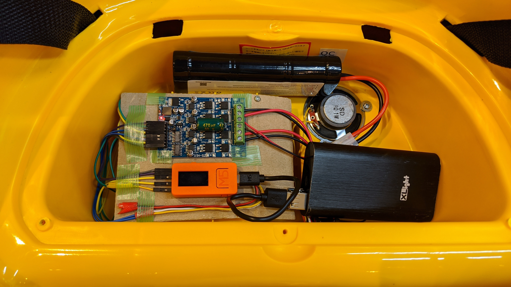

# M5-ZAKRELLO

# 部品
- [M5StickC](https://amzn.to/35VmnAq)
- [DCブラシ付き モータドライバボード 16A](https://amzn.to/3mCBOmQ)
- [12Vモーターを搭載したギアボックス](https://amzn.to/3kzMHUz) x2 
- [7.2v ニッケル水素バッテリー](https://amzn.to/3cftdlr)
- [ニッケル水素 急速充電器](https://amzn.to/35Upg4c)  

# 配線

# OSC 情報
- IP  
M5StickC 液晶に表示される
- ポート  
54345

※ IPアドレスは ルーター接続毎に変更される可能性があるので、入力で変更きるようにする事。

## 各コマンド

- スピード  
/status/duty 0.0-255.0  
0.0 停止  
255.0 最速  

- モータ駆動  
/status/motor 0.0 - 4.0  
0.0f  停止  
1.0f  前進  
2.0f  後進  
3.0f  左旋回  
4.0f  右旋回  

